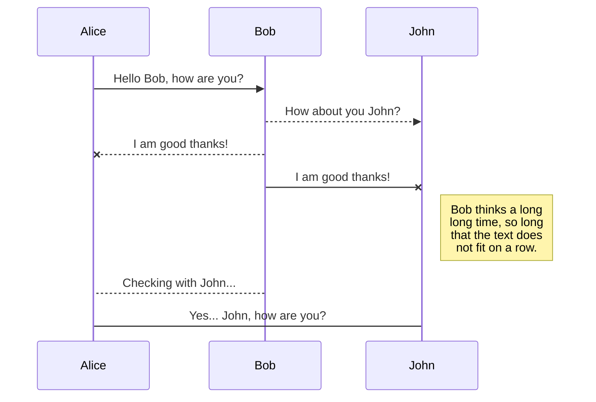

元ネタはこちらのものです
https://webdeasy.de/en/program-wysiwyg-editor/

# 概要
PureJavaScriptでのWYSIWYG

# 課題
## コラボレータ全員への課題
+ 本体はJSであり、リスナーが重要な動きをしています。その部分の理解を進めてください
+ BootstrapのCSSも重要な動きをしています。カスタマイズする際に必要となるのでBootstrapへの理解も進めてください
+ 表示はvisuell-viewで行っており、HTMLとのトグルアイコンでhtml-viewと切り替えています。この動きへの理解も進めてください

## 画像
+ 画像の読み込み（最大画像サイズへ変換）
+ Base64へ変換(JSのライブラリを使うかJSで自前実装)
+ 位置やサイズの変更（画像選択時の挙動でリスナーで受け取り実装）

## コピペ
+ VSCodeやブラウザのHTMLからコピペした際にコピペ元の文字色・背景色などを引き継いでペーストしたい
+ 画像コピペにも対応したい

## アイコンの自前持
+ アイコンを独自デザインにして、ローカルフォルダに配置したい

